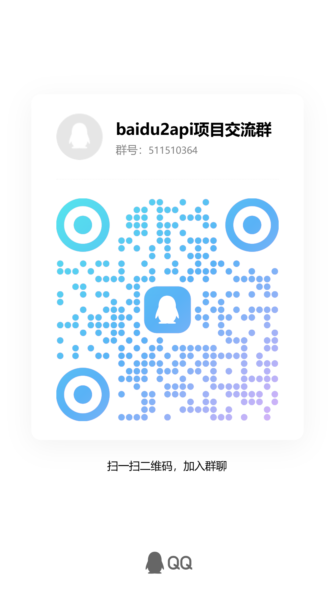

# Baidu2API

将 [chat.baidu.com](https://chat.baidu.com) 的 AI 对话能力封装为 OpenAI 兼容 API，无需登录即可使用。

**English**: [README_EN.md](README_EN.md)

## 功能特性

- **OpenAI 兼容** — 完整支持 `/v1/chat/completions` 和 `/v1/models` 接口
- **多模型支持** — DeepSeek-V4、DeepSeek-R1、ERNIE-4.5、智能模式
- **流式输出** — 支持 SSE 流式响应，兼容所有 OpenAI SDK
- **思维链输出** — DeepSeek-R1 的推理过程通过 `reasoning_content` 字段输出
- **双模式工具调用** — 支持 XML（Toolify 风格）和 JSON（DS2API 风格）两种函数调用机制
- **API Key 认证** — 可选的 API Key 认证机制，保护你的 API 不被滥用
- **Web 管理后台** — 可视化管理配置、API Key、工具调用模式
- **上下文隔离** — 每次请求独立，不会泄漏跨请求的会话信息
- **无限上下文** — 默认不限制 prompt 长度，可配置最大长度
- **零配置启动** — 无需百度账号，开箱即用

## 支持的模型

| 模型 ID | 百度模型 | 思维链 | 说明 |
|---------|---------|--------|------|
| `deepseek-v4-pro` | DeepSeek-V4 | ✅ | DeepSeek V4，1M 上下文 |
| `deepseek-r1` | DeepSeek-R1 | ✅ | DeepSeek R1 推理模型 |
| `ernie-4.5-turbo` | ERNIE-4.5 | ❌ | 文心 4.5 |
| `smartMode` | 智能模式 | ❌ | 百度智能路由 |

## 快速开始

### 方式一：本地运行

```bash
# 克隆仓库
git clone https://github.com/dijiaozhibei-top/baidu2api.git
cd baidu2api

# 安装依赖
pip install -r requirements.txt

# 启动服务
python main.py

# 调试模式
python main.py debug
```

服务默认监听 `http://0.0.0.0:8000`

### 方式二：Docker 运行（预编译镜像）

```bash
# 复制环境变量配置文件
cp .env.example .env
# 编辑 .env 设置管理员密钥
# BAIDU2API_ADMIN_KEY=your-secret-key

# 使用 Docker Compose 启动
docker-compose up -d

# 查看日志
docker-compose logs -f
```

镜像地址：
- **Docker Hub**：`dijiaozhibei/baidu2api:latest`
- 🇨🇳 国内镜像加速：`docker.1ms.run/dijiaozhibei/baidu2api:latest`
- **ghcr.io**：`ghcr.io/dijiaozhibei-top/baidu2api:latest`
- 🇨🇳 国内镜像加速：`ghcr.nju.edu.cn/dijiaozhibei-top/baidu2api:latest`

也可以直接使用 `docker run`：

```bash
docker run -d -p 8000:8000 \
  -e BAIDU2API_ADMIN_KEY=mysecret \
  -v ./config.json:/app/config.json \
  dijiaozhibei/baidu2api:latest
```

### 方式三：手动 Docker 构建

```bash
docker build -t baidu2api .
docker run -d -p 8000:8000 --name baidu2api baidu2api
```

## Web 管理后台

启动服务后访问 `http://localhost:8000/admin/` 进入管理后台。

首次访问管理后台时，需要创建管理员密码（至少4位）。之后每次访问需使用该密码登录。

管理后台支持：
- 查看服务状态
- 切换工具调用模式（XML / JSON）
- 管理 API Key（增删）
- 修改配置

## API Key 认证

默认不启用认证。通过管理后台添加 API Key 后自动启用认证。

启用后，所有 `/v1/chat/completions` 请求需携带 `Authorization: Bearer <your-api-key>` 头。

```bash
curl http://localhost:8000/v1/chat/completions \
  -H "Authorization: Bearer your-api-key" \
  -H "Content-Type: application/json" \
  -d '{"model": "deepseek-v4-pro", "messages": [{"role": "user", "content": "你好"}]}'
```

## 工具调用

支持两种函数调用机制，可在管理后台切换：

### XML 模式（Toolify 风格，默认）

使用 XML 标签格式触发工具调用，兼容性更好：

```bash
curl http://localhost:8000/v1/chat/completions \
  -H "Content-Type: application/json" \
  -d '{
    "model": "deepseek-v4-pro",
    "messages": [{"role": "user", "content": "北京天气怎么样？"}],
    "tools": [{
      "type": "function",
      "function": {
        "name": "get_weather",
        "description": "获取指定城市的天气",
        "parameters": {
          "type": "object",
          "properties": {"location": {"type": "string", "description": "城市名称"}},
          "required": ["location"]
        }
      }
    }]
  }'
```

### JSON 模式（DS2API 风格）

使用 JSON 格式触发工具调用，与 DS2API 项目兼容。

两种模式均支持自动回退：当主模式解析失败时，会自动尝试另一种模式解析。

## API 文档

### 获取模型列表

```bash
curl http://localhost:8000/v1/models
```

### 对话补全

```bash
curl http://localhost:8000/v1/chat/completions \
  -H "Content-Type: application/json" \
  -d '{
    "model": "deepseek-v4-pro",
    "messages": [{"role": "user", "content": "你好"}],
    "stream": false
  }'
```

### 流式对话

```bash
curl http://localhost:8000/v1/chat/completions \
  -H "Content-Type: application/json" \
  -d '{
    "model": "deepseek-r1",
    "messages": [{"role": "user", "content": "1+1等于几？"}],
    "stream": true
  }'
```

## 接入第三方客户端

### OpenAI SDK (Python)

```python
from openai import OpenAI

client = OpenAI(
    base_url="http://localhost:8000/v1",
    api_key="not-needed"
)

response = client.chat.completions.create(
    model="deepseek-v4-pro",
    messages=[{"role": "user", "content": "你好"}],
    stream=True
)

for chunk in response:
    if chunk.choices[0].delta.content:
        print(chunk.choices[0].delta.content, end="")
```

### OpenAI SDK (Node.js)

```javascript
import OpenAI from 'openai';

const client = new OpenAI({
  baseURL: 'http://localhost:8000/v1',
  apiKey: 'not-needed',
});

const stream = await client.chat.completions.create({
  model: 'deepseek-r1',
  messages: [{ role: 'user', content: '你好' }],
  stream: true,
});

for await (const chunk of stream) {
  process.stdout.write(chunk.choices[0]?.delta?.content || '');
}
```

### Claude Code / Cursor / Continue 等工具

在工具设置中将 API Base URL 设为 `http://localhost:8000/v1`，API Key 填任意值即可（未启用认证时）。

## 配置说明

配置文件为 `config.json`，支持环境变量 `BAIDU2API_CONFIG_PATH` 指定路径。

| 配置项 | 默认值 | 说明 |
|--------|--------|------|
| `api_keys` | `[]` | API Key 列表，为空时不启用认证 |
| `admin_key` | `""` | 管理后台访问密钥（首次访问时创建） |
| `toolcall_mode` | `"xml"` | 工具调用模式：`xml` 或 `json` |
| `max_query_length` | `0` | 最大 prompt 长度，0 表示不限制 |

## 项目结构

```
baidu2api/
├── main.py            # FastAPI 服务（OpenAI 格式适配、流式输出）
├── baidu_client.py    # 百度聊天 API 客户端（Token 管理、SSE 解析）
├── toolcall.py        # 双模式工具调用（XML + JSON）
├── config.py          # 配置管理（JSON 持久化）
├── admin.py           # Web 管理后台（认证、API Key 管理）
├── requirements.txt   # Python 依赖
├── Dockerfile         # Docker 构建文件
├── docker-compose.yml # Docker Compose 配置
├── .gitignore
├── .dockerignore
├── LICENSE
└── README.md
```

## 工作原理

1. **Token 获取** — 访问 chat.baidu.com 首页，从页面 HTML 中提取 token 和 lid
2. **签名生成** — 使用 `base64(token|md5(query)|timestamp|lid)-lid-3` 生成 chat_token
3. **消息拼接** — 将 OpenAI 多消息格式（system/user/assistant/tool）扁平化为单条文本
4. **工具注入** — 根据配置模式将工具定义注入 prompt，引导模型输出结构化调用
5. **SSE 流式** — 解析百度 SSE 事件流，实时转换为 OpenAI 兼容的 SSE 格式
6. **上下文隔离** — 共享 HTTP 客户端保持 Cookie，但每次请求使用空 ori_lid 确保独立

## 注意事项

- 本项目仅供学习交流使用，请勿用于商业用途
- 百度可能会随时更改 API 接口，导致本项目失效
- 请合理使用，避免高频请求给百度服务器带来压力
- 本项目不收集、不存储任何用户数据

## QQ 交流群

点击链接加入群聊【baidu2api项目交流群】：https://qm.qq.com/q/Rrv76AeZmG

群号：511510364



## 致谢

- [ds2api](https://github.com/CJackHwang/ds2api) — 提供了将 Web 聊天封装为 OpenAI API 的架构参考及 JSON 工具调用机制
- [toolify](https://github.com/funnycups/toolify) — 提供了 XML 工具调用机制的参考

## 许可证

[AGPL-3.0](LICENSE)

本项目集成了 [toolify](https://github.com/funnycups/toolify)（GPL-3.0）和 [ds2api](https://github.com/CJackHwang/ds2api)（AGPL-3.0）的代码，因此采用 AGPL-3.0 许可证。
